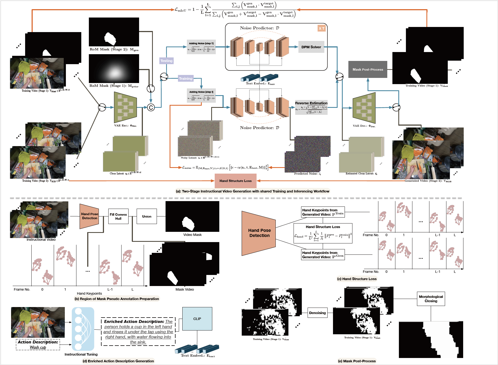

<div align="center">
  
# Instructional Video Generation

[Yayuan Li](https://www.linkedin.com/in/yayuan-li-148659272/), [Zhi Cao](zhicao@umich.edu), [Jason J. Corso](https://web.eecs.umich.edu/~jjcorso/)

[COG Research Group, University of Michigan](https://github.com/MichiganCOG)

<a href='https://arxiv.org/abs/2412.04189'></a> 
<a href='https://excitedbutter.github.io/Instructional-Video-Generation/'></a>
</div>


Our model is a diffusion-based instructional video generation method that achieves **precise hand motion controllability** and **enhanced visual-action alignment** by leveraging automatic region of motion generation and a novel hand structure loss.

If you find our project helpful, please give it a star :star: or [cite](#bibtex) it, we would be very grateful :sparkling_heart: .


## Showcases
<table class="center">
  
  <tr>
    <td>Input image</td>
    <td>Result</td>
    <td>Input image</td>
    <td>Result</td>
  </tr>
  
  <tr>
    <td></td>
    <td></td>
    <td></td>
    <td></td>
  </tr>
  
  <tr>
    <td colspan="2" align="center"><strong><em>Action Description:</em></strong> Knit the fabric.</td>
    <td colspan="2" align="center"><strong><em>Action Description:</em></strong> Roll dough.</td>
  </tr>

  <tr>
    <td></td>
    <td></td>
    <td></td>
    <td></td>
  </tr>
  
  <tr>
    <td colspan="2" style="width:350;" align="center">
      <strong><em>Action Description:</em></strong> Pour vinegar into bowl.
    </td>
    <td colspan="2" style="width:350;" align="center">
      <strong><em>Action Description:</em></strong> Pick up and crack egg.
    </td>
  </tr>

  <tr>
    <td></td>
    <td></td>
    <td></td>
    <td></td>
  </tr>
  
  <tr>
    <td colspan="2" style="width:350;" align="center">
      <strong><em>Action Description:</em></strong> Throw paper into bin.
    </td>
    <td colspan="2" style="width:350;" align="center">
      <strong><em>Action Description:</em></strong> Shake soy milk.
    </td>
  </tr>
  
</table>


## Framework


## News 🔥
**2024.12.9**: Released inference code and updated the model to instructional_video_v1.0

## Features Planned
- 💥 Release training code
- 💥 Video generatinon with camera movement.
- 💥 Support Huggingface Demo / Google Colab.
- etc.

## Getting Started
This repository is based on [animate-anything](https://github.com/alibaba/animate-anything).

### Create Conda Environment (Optional)
It is recommended to install Anaconda.

**Windows Installation:** https://docs.anaconda.com/anaconda/install/windows/

**Linux Installation:** https://docs.anaconda.com/anaconda/install/linux/

```bash
conda create -n IVG python=3.10
conda activate IVG
```

### Python Requirements
```bash
pip install -r requirements.txt
```

## Running inference
Please download the [pretrained model](https://drive.google.com/file/d/1sWlr5r54_XxqdgHoCacS7opoucABpEVx/view?usp=drive_link) to output/latent, then run the following command. Please replace the {download_model} to your download model name:
```bash
python train.py --config output/latent/{download_model}/config.yaml --eval validation_data.prompt_image=example/Julienne_carrot.png validation_data.prompt='The person holds a carrot on the chopping board with the left hand and uses a knife in the right hand to julienne the carrot.'
```

To control the motion area, we use the provided script `mask_video.py`. Update the input and output video folder paths as needed, and run the following command:
```bash
python mask_video.py
```

Below are examples of an input image and its corresponding RoM mask:

<p align="center">


</p>

Then run the following command for inference:
```bash
python train.py --config output/latent/{download_model}/config.yaml --eval validation_data.prompt_image=example/Julienne_carrot.png validation_data.prompt='The person holds a carrot on the chopping board with the left hand and uses a knife in the right hand to julienne the carrot.' validation_data.mask=example/carrot_mask.jpg 
```
<p align="center">  </p>


### Configuration

The configuration uses a YAML config borrowed from [Tune-A-Video](https://github.com/showlab/Tune-A-Video) repositories. 

All configuration details are placed in `example/train_mask_motion.yaml`. Each parameter has a definition for what it does.


## Bibtex
Please cite this paper if you find the code is useful for your research:
```
@misc{li2024instructionalvideogeneration,
      title={Instructional Video Generation}, 
      author={Yayuan Li and Zhi Cao and Jason J. Corso},
      year={2024},
      eprint={2412.04189},
      archivePrefix={arXiv},
      primaryClass={cs.CV},
      url={https://arxiv.org/abs/2412.04189}, 
}
```
